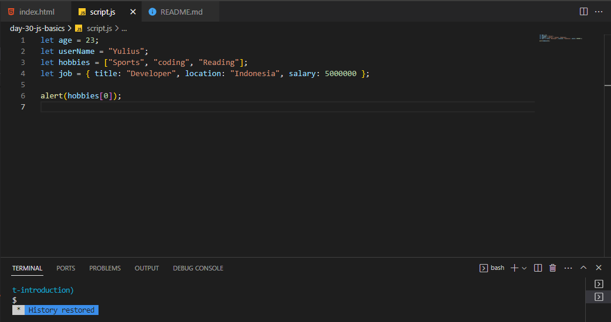

# 100 Days Of Code - 2023 Web Development Bootcamp

## Day 30: Unleashing JavaScript Magic ✨

Welcome to Day 30 of my 100 Days Of Code journey in the "100 Days Of Code - 2023 Web Development Bootcamp." Today, I embarked on an enchanting journey into the world of JavaScript, unlocking its incredible power and versatility. Let me walk you through the highlights of this magical day:

**Day 30 Highlights:**

- **Adding the "script" HTML Element**: I kicked off the day by introducing the "script" HTML element, the gateway to the enchanting world of JavaScript.

- **Working with Values & Basic JavaScript Commands**: Dive deeper into the magical realm of JavaScript as I explored values and basic commands, laying a solid foundation for my scripting adventures.

- **Introducing Variables ("Data Containers")**: I uncovered the role of variables, the essential data containers that hold the secrets to dynamic scripts.

- **A Closer Look At The JavaScript Syntax**: I took a closer look at the syntax of JavaScript, understanding its rules and nuances, making my code more potent.

- **A Second Variable & Practice Time!**: With newfound knowledge, I embraced a second variable and engaged in practice sessions to solidify my skills.

- **Outsourcing JavaScript Code Into External Files**: I delved into the practice of outsourcing JavaScript code into external files, enhancing code organization and reusability.

- **Introducing Arrays (Managing Lists Of Data)**: Arrays made their grand entrance, allowing me to manage lists of data more efficiently and effectively.

- **Introducing Objects (Grouping Related Data)**: I ventured into the realm of objects, learning how these powerful structures help me group related data and build complex applications.

This day was a magical journey, filled with JavaScript spells and the unlocking of new possibilities. JavaScript is truly an enchanting companion in our web development journey. 🪄💻🚀

Stay tuned for more enchanting moments as I continue to weave coding spells and explore the art of web development! ✨🌐

## Connect With Me

- **Twitter**: [@ylssty17](https://twitter.com/ylssty17)
- **LinkedIn**: [Yulius Setyawan](https://linkedin.com/in/yulius17)

Join me in casting spells with code and let's make magic happen together! 🌟💻
