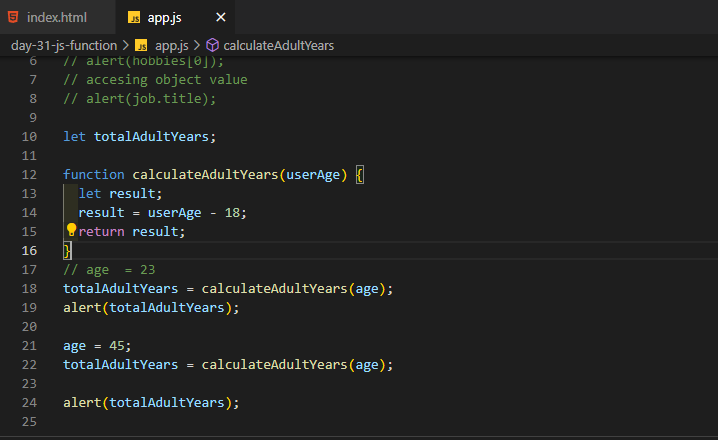

# 100 Days Of Code - 2023 Web Development Bootcamp

## Day 31: Exploring JavaScript Functions and Objects

Welcome to Day 31 of my 100 Days Of Code journey in the "100 Days Of Code - 2023 Web Development Bootcamp." Today was all about diving into JavaScript functions and objects, building on our growing knowledge of this versatile language. Here's a summary of the day's highlights:

**Day 31 Highlights:**

- **Splitting Code Across Multiple Lines**: I started the day by learning how to split code across multiple lines for better readability and maintainability.

- **Accessing Object Properties**: Delving into objects, I explored how to access their properties and work with the data they hold.

- **Performing Operations**: I learned how to perform various operations, manipulating data within objects.

- **Onwards To Custom Commands!**: The day's journey led to custom commands and the exciting world of JavaScript functions.

- **Introducing Functions**: I embarked on the journey of functions, understanding their role in making our code modular and reusable.

- **Functions & Variables**: The connection between functions and variables became clear, allowing for dynamic and interactive scripts.

- **Returning Values In Functions**: I explored how functions can return values, a fundamental aspect of their functionality.

- **Passing Data Into Functions With Parameters**: The concept of function parameters enabled me to create dynamic and customizable functions.

- **Functions - A Summary**: The day concluded with a summary of the newfound knowledge about JavaScript functions, setting the stage for further exploration.

The day's learning journey was filled with insights into JavaScript's building blocks, functions, and objects. These are essential tools in creating interactive and dynamic web applications. 🚀📝

Stay tuned for more updates as I continue to unravel the world of web development and JavaScript in this 100-day journey! 💡🌐

## Connect With Me

- **Twitter**: [@ylssty17](https://twitter.com/ylssty17)
- **LinkedIn**: [Yulius Setyawan](https://linkedin.com/in/yulius17)

Let's keep learning and coding together! 🌟💻
