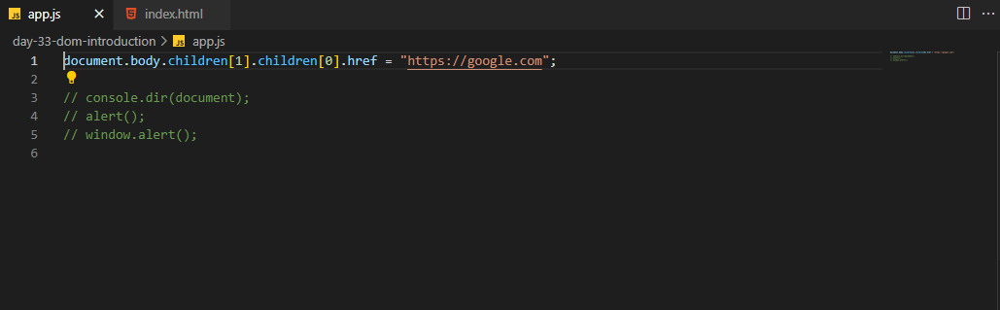

# 100 Days Of Code - 2023 Web Development Bootcamp

## Day 33: Understanding the DOM (Document Object Model)

Welcome to Day 33 of my 100 Days Of Code journey in the "100 Days Of Code - 2023 Web Development Bootcamp." Today was all about diving into the Document Object Model (DOM), a fundamental concept in web development. Here's what I learned:

**Day 33 Highlights:**

- **The Global "window" & "document" Objects**: I delved into the global "window" and "document" objects, essential components of the web browser's environment.

- **What Is "The DOM"?**: I gained a clear understanding of "The DOM" and its role as a representation of the web page structure that JavaScript can manipulate.

- **Exploring The DOM**: I explored the DOM, learning how to access and manipulate elements using JavaScript.

- **Drilling Into The DOM To Select & Change HTML Elements**: I practiced selecting and changing HTML elements within the DOM, bringing interactivity to web pages.

- **Loading Our Script Correctly**: I ensured my JavaScript scripts load correctly, following best practices for web development.

- **The DOM Tree & DOM Traversal**: I studied the DOM tree structure and mastered DOM traversal techniques, which are vital for web development.

The DOM is the foundation of interactive web pages, and today's exploration brings me one step closer to building dynamic, user-friendly web applications. 🌐🖥️

Stay tuned for more exciting insights and coding adventures as I continue my journey into web development! 💻🚀

## Connect With Me

- **Twitter**: [@ylssty17](https://twitter.com/ylssty17)
- **LinkedIn**: [Yulius Setyawan](https://linkedin.com/in/yulius17)

Let's keep learning and coding together! 🌟💡
