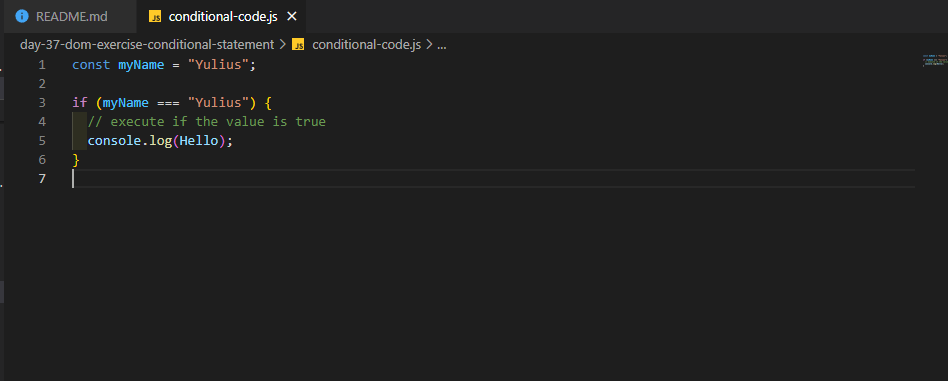

# 100 Days Of Code - 2023 Web Development Bootcamp

## Day 37: Control Structures and Conditional Code Execution

Welcome to Day 37 of my 100 Days Of Code journey in the "2023 Web Development Bootcamp." Today was all about control structures and conditional code execution in JavaScript. Here's a summary of what I learned:

**Day 37 Highlights:**

- **Getting Started with "Control Structures"**: I began the day by diving into control structures, which are fundamental to directing the flow of a program.

- **Introducing Boolean Values ("Booleans") & Comparison Operators**: I explored the concept of Boolean values and learned about comparison operators, which are essential for making decisions in code.

- **Booleans & Comparison Operators In Action**: I put my knowledge into practice by working with Booleans and comparison operators, creating conditions to control program flow.

- **Using Booleans In "if" Statements (Conditional Code Execution)**: I delved into conditional code execution using 'if' statements, a crucial concept for adding decision-making capabilities to my code.

Today's focus on control structures and conditional code execution has opened up new possibilities in my coding journey. I'm excited to continue learning and applying these fundamental concepts in my projects. 📝💻🚀

Stay tuned for more updates as I explore web development in this 100-day challenge! 💡🌐

## Connect With Me

- **Twitter**: [@ylssty17](https://twitter.com/ylssty17)
- **LinkedIn**: [Yulius Setyawan](https://linkedin.com/in/yulius17)

Let's keep learning and coding together! 🌟💻
