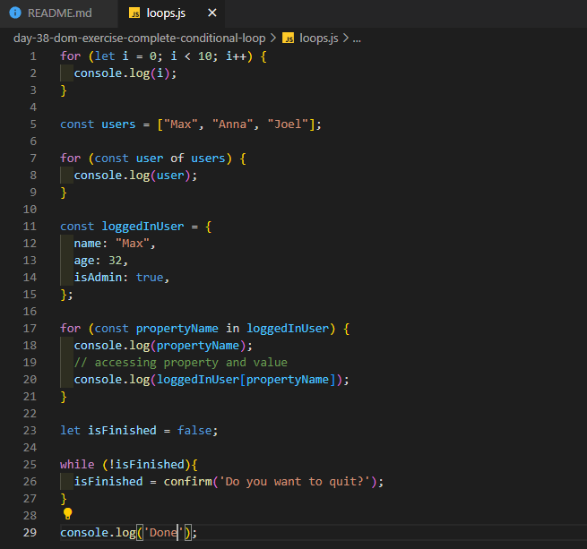

# 100 Days Of Code - 2023 Web Development Bootcamp

## Day 38: Conditional Statements & Introduction to Loops

Welcome to Day 38 of the 100 Days Of Code - 2023 Web Development Bootcamp. Today's journey was filled with learning about conditional statements and the exciting introduction to loops. Here's what I explored:

**Day 38 Highlights:**

- **A Real Example**: I kicked off the day with a practical example of using conditional statements to control code execution based on certain conditions.

- **Alternatives with "else" and "else if"**: I delved deeper into conditional statements by exploring alternative paths using "else" and "else if."

- **More on Boolean Values**: Understanding Boolean values, a fundamental concept in JavaScript.

- **"Truthy" & "Falsy" Values**: Explored how JavaScript treats different values as either "truthy" or "falsy" in certain contexts.

- **Quiz 8 - Learning Check: "if" Statements**: Tested my understanding of "if" statements and Boolean conditions with a quiz.

- **Introducing Loops (Repeated Code Execution)**: Embarked on a new phase of coding with an introduction to loops, a powerful concept for executing code repeatedly.

- **The Regular "for" Loop**: Started exploring loops with the commonly used "for" loop, designed for tasks that need repetition.

- **The "for-of" Loop (for Arrays)**: Learned about the "for-of" loop, ideal for iterating over elements in arrays.

- **Using the Regular "for" Loop with Arrays**: Put the "for" loop to use by iterating through arrays.

- **The "for-in" Loop (for Objects)**: Introduced to the "for-in" loop, which comes in handy for looping through object properties.

- **The "while" Loop**: Expanded my knowledge by diving into the "while" loop, which keeps executing code while a specified condition remains true.

These insights into conditional statements and the introduction of loops mark another step in my coding journey. 🚀

Stay tuned for more updates as I continue to explore web development and JavaScript in this 100-day adventure! 💡🌐

## Connect With Me

- **Twitter**: [@ylssty17](https://twitter.com/ylssty17)
- **LinkedIn**: [Yulius Setyawan](https://linkedin.com/in/yulius17)

Let's keep learning and coding together! 🌟💻

