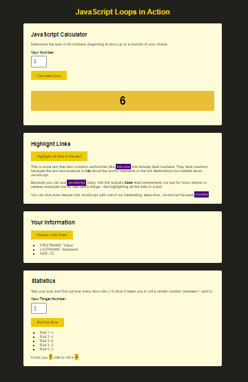

# 100 Days Of Code - 2023 Web Development Bootcamp

## Day 39: Mastering Loops - for, for-of, for-in, and while

Welcome to Day 39 of the 100 Days Of Code - 2023 Web Development Bootcamp! Today, I dived deep into the world of loops in JavaScript. Here's a summary of the day's journey:

**Day 39 Highlights:**

- **Practice Time: Setup & The "for" Loop:** Kicked off the day by setting up practice sessions and mastering the "for" loop, a fundamental tool for controlled code repetition.

- **Practice Time: The "for-of" Loop:** Explored the "for-of" loop, specially designed for traversing arrays and making data manipulation a breeze.

- **Practice Time: The "for-in" Loop:** Delved into the "for-in" loop, a fantastic choice for working with object properties and gaining a better understanding of data structures.

- **Practice Time: The "while" Loop:** Concluded my practice sessions with the versatile "while" loop, perfect for handling various scenarios that require code execution based on conditions.

- **Module Summary:** Wrapped up the day by summarizing the powerful world of loops, ready to add dynamic behavior to my web applications.

Loops are the building blocks of code repetition and control in JavaScript. Today's practice sessions have sharpened my skills, and I'm excited to apply these concepts to real projects. 🚀👨‍💻

Stay tuned as I continue my web development journey, one day at a time. 💡🌐

## Connect With Me

- **Twitter**: [@ylssty17](https://twitter.com/ylssty17)
- **LinkedIn**: [Yulius Setyawan](https://linkedin.com/in/yulius17)

Let's keep learning and coding together! 🌟💻
