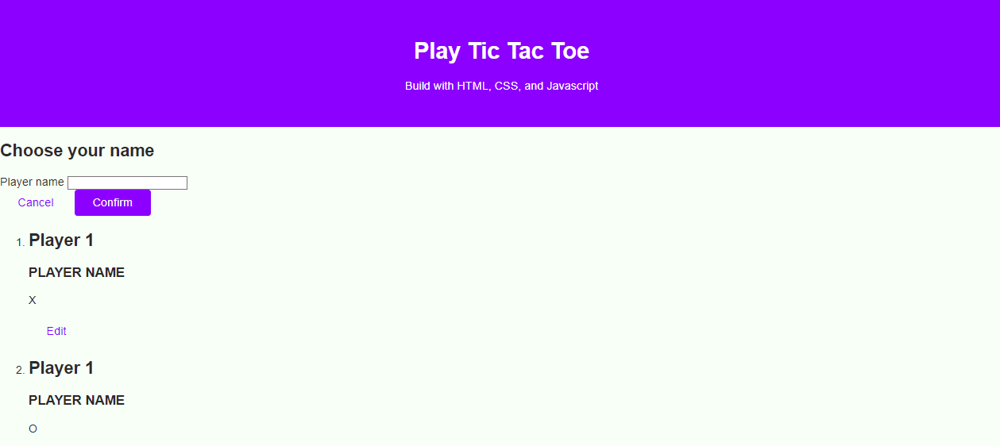

# 100 Days Of Code - 2023 Web Development Bootcamp

## Day 40: Tic Tac Toe Game Project - HTML, CSS, and JavaScript

Welcome to Day 40 of my 100 Days Of Code journey in the "100 Days Of Code - 2023 Web Development Bootcamp." Today marks the beginning of a new project - building a Tic Tac Toe game using HTML, CSS, and JavaScript. Here's a summary of what I worked on today:

**Day 40 Highlights:**

- **Planning The Project**: I started by planning the structure of the Tic Tac Toe game project, outlining the HTML elements and overall game design.

- **Creating The HTML Structure**: With the project plan in mind, I proceeded to create the HTML structure, defining the game board and other essential elements.

- **Adding Base Page Styles**: To provide a good starting point, I added basic CSS styles to the page, setting the stage for further styling.

This project is an exciting journey into game development with web technologies. I can't wait to continue working on it and create a fun and interactive game. Stay tuned for updates on the progress! 🎮💻

## Connect With Me

- **Twitter**: [@ylssty17](https://twitter.com/ylssty17)
- **LinkedIn**: [Yulius Setyawan](https://linkedin.com/in/yulius17)

Let's keep learning and coding together! 🌟💻
