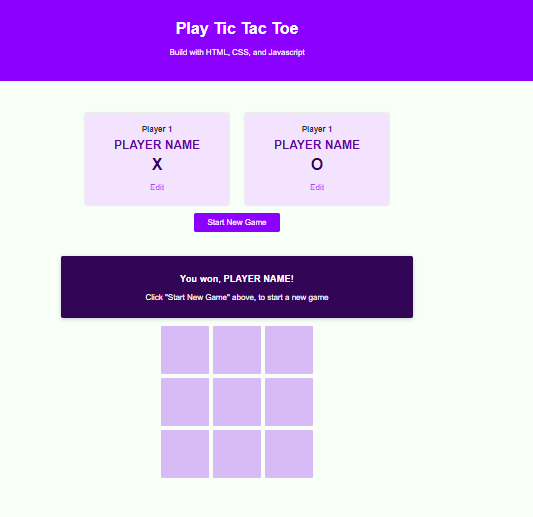

# 100 Days Of Code - 2023 Web Development Bootcamp

## Day 41: Tic Tac Toe Project Progress

Welcome to Day 41 of the 100 Days Of Code - 2023 Web Development Bootcamp. Today, I continued working on our exciting Tic Tac Toe project. Here's a summary of my progress:

**Day 41 Highlights:**

- **Adding Styling for the Game Configuration Area**: I improved the visual appeal of the game configuration area, making it more user-friendly.

- **Styling the Game Board**: The game board received a makeover, enhancing the gaming experience.

- **Adding JavaScript, Script Files & First Event Listeners**: I introduced JavaScript to our project, set up script files, and added the first event listeners for interactivity.

- **Showing & Hiding The Configuration Modal (Overlay)**: I implemented the functionality to show and hide the configuration modal overlay. This feature adds user control to the game settings.

With each passing day, our Tic Tac Toe project is becoming more engaging and interactive. I can't wait to see it in action! 🎮💡

Stay tuned for further updates as I dive deeper into this fun project. 

## Connect With Me

- **Twitter**: [@ylssty17](https://twitter.com/ylssty17)
- **LinkedIn**: [Yulius Setyawan](https://linkedin.com/in/yulius17)

Let's keep learning and coding together! 🌟💻
