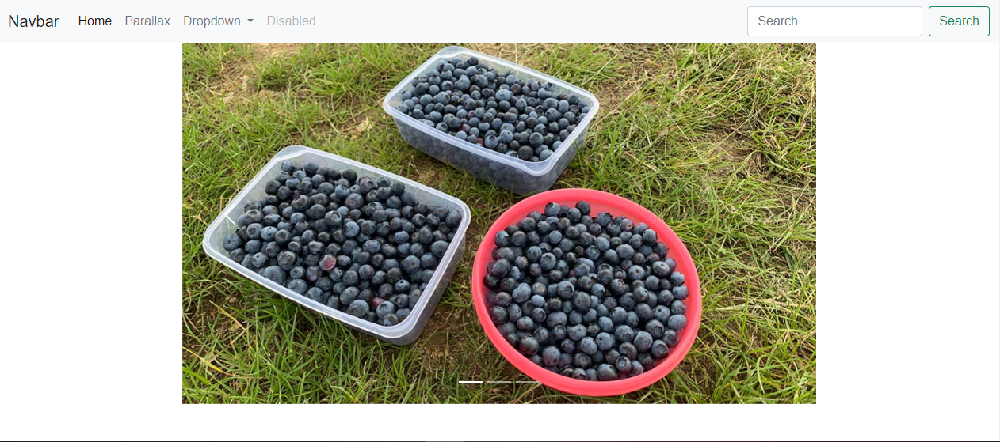

# 100 Days Of Code - 2023 Web Development Bootcamp

## Day 45: Exploring Third-Party Code in Web Development

Welcome to Day 45 of my 100 Days Of Code journey in the "2023 Web Development Bootcamp." Today was all about diving into the realm of third-party code and harnessing its power for web development. Here's a breakdown of the day's highlights:

**Day 45 Highlights:**

- **Module Introduction**: Kicked off the day with an introduction to third-party code and its significance in web development.

- **What & Why?**: Explored the reasons behind using third-party code and its impact on efficiency and functionality.

- **Third-Party Code vs Custom Code**: Delved into the comparison between third-party code and custom code, weighing the pros and cons.

- **First Example: Adding Bootstrap**: Implemented Bootstrap to introduce default styling effortlessly, enhancing the visual appeal.

- **Adding & Using Bootstrap CSS Package**: Integrated the Bootstrap CSS package for a seamless styling experience, demonstrating the power of external packages.

- **Adding a JavaScript Package**: Expanded the exploration by adding a JavaScript package, showcasing the versatility of third-party tools.

- **Adding an Image Carousel / Gallery**: Implemented an image carousel using a third-party package, adding dynamic and engaging content to the project.

- **Combining Third-Party Packages With Custom Code**: Explored the synergy of third-party and custom code, highlighting how they complement each other.

- **More Bootstrap Examples**: Dived into additional examples to solidify understanding and maximize the potential of Bootstrap.

- **Exercise Solution & First Summary**: Tackled an exercise, consolidating the learning and providing a brief summary of the progress.

- **Another Example: Preparing a Parallax Page**: Concluded the day with another practical example, preparing a parallax page with third-party enhancements.

Today's journey opened up exciting possibilities with third-party code, blending convenience with customization for a robust web development experience. 🚀💻🌟

Stay tuned for more updates as the coding adventure continues! 🎉👩‍💻🌐

## Connect With Me

- **Twitter**: [@ylssty17](https://twitter.com/ylssty17)
- **LinkedIn**: [Yulius Setyawan](https://linkedin.com/in/yulius17)

Let's keep learning and coding together! 🚀🌟💻
