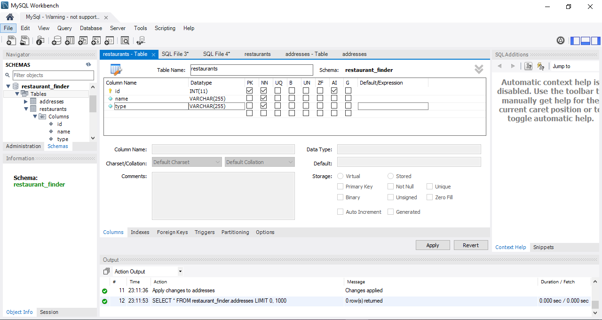

# 100 Days Of Code - 2023 Web Development Bootcamp

## Day 58: Unleashing the Power of SQL Databases

Welcome to Day 58 of my 100 Days Of Code journey! Today was an exciting dive into the realm of SQL databases. Here's a snapshot of what I explored:

- **Creating a Table & Table Structure in SQL**: I got hands-on with defining the blueprint for my data using SQL tables.
- **Inserting Data into a Table**: Started populating my tables with meaningful data, laying the foundation for dynamic content.
- **Reading Data From a Table (incl. Filtering)**: Explored the art of fetching specific data from tables, a crucial skill in database management.
- **Updating & Deleting Data**: Mastered the techniques to modify and remove data entries, ensuring data accuracy.
- **Designing a More Complex Database**: Leveled up my database architecture skills by working on a more intricate database structure.
- **Adding a New Table**: Expanded the database ecosystem by introducing a new table, enhancing data organization.

These skills are pivotal for any web developer dealing with dynamic content and user interactions. Excited to continue the journey of mastering databases! 🎉💽💻

Stay tuned for more coding adventures as I progress through the 100-day challenge! 🚀👨‍💻

## Connect With Me

- **Twitter**: [@ylssty17](https://twitter.com/ylssty17)
- **LinkedIn**: [Yulius Setyawan](https://linkedin.com/in/yulius17)

Let's keep building amazing things with code! 🌟💻
