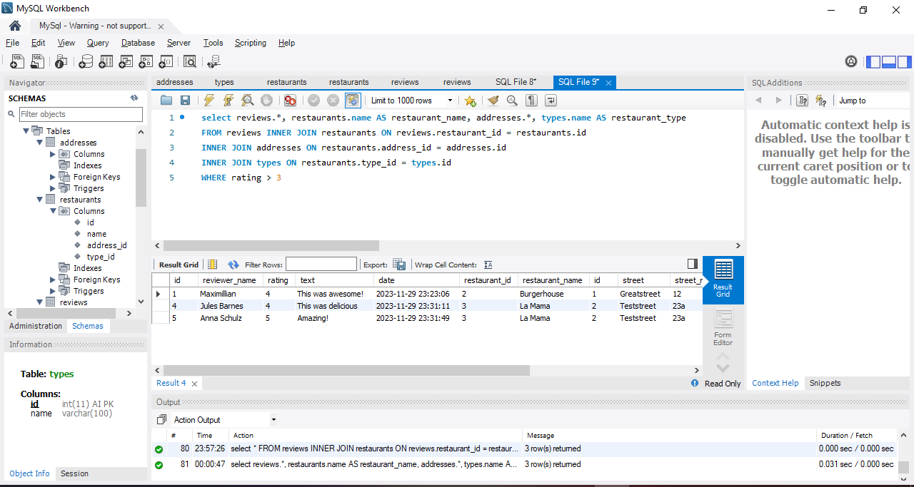

# 100 Days Of Code - 2023 Web Development Bootcamp

## Day 59: Advanced Database Design in SQL

Welcome to Day 59 of my 100 Days Of Code journey in the "2023 Web Development Bootcamp." Today was all about diving into more advanced aspects of database design with a focus on SQL.

**Day 59 Highlights:**

- **Implementing A More Complex Design With Relations:** Explored advanced database design concepts, emphasizing relationships between tables.
  
- **Inserting Related Data:** Learned techniques for inserting data into tables with complex relationships.

- **Practice: Inserting Related Data:** Applied the knowledge gained through practical exercises to solidify understanding.

- **Querying & Joining Related Data:** Delved into querying and joining data from tables with relationships.

- **Practice: Joining Data:** Applied hands-on exercises to practice and reinforce the skill of joining related data.

- **Module Summary & More On Relationships:** Wrapped up the day with a module summary, preparing for a deeper understanding of database structures and relationships.

The journey into advanced database design in SQL was challenging and rewarding, paving the way for more sophisticated applications. 🛠️🔗

Stay tuned for more updates as I continue to explore the world of web development in this 100-day coding challenge! 💻✨

## Connect With Me

- **Twitter**: [@ylssty17](https://twitter.com/ylssty17)
- **LinkedIn**: [Yulius Setyawan](https://linkedin.com/in/yulius17)

Let's keep coding and learning together! 🚀🌐
