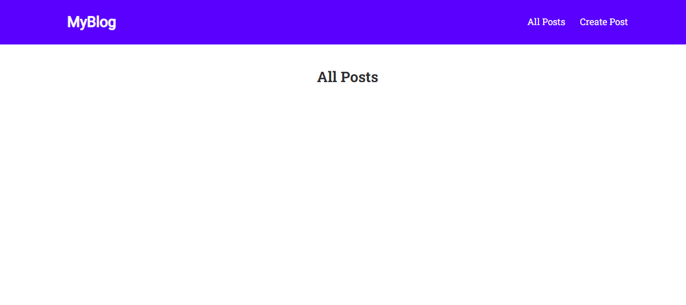

# 100 Days Of Code - Web Development

## Day 60: Building a Blog Page - Backend Setup and Routes

Welcome to Day 60 of my #100DaysOfCode challenge! Today's focus is on setting up the backend for a blog page. Here's a summary of what I accomplished:

- **Why Backend for Database Access**: Explored the importance of running database-accessing code on the backend, ensuring secure and controlled access to data.

- **Project Overview**: Introduced the blog page project, highlighting the key features to be implemented.

- **Planning Database Structure**: Discussed the planning phase for the database structure, a crucial step in designing a robust backend.

- **Database Initialization**: Executed the initialization process for the database, laying the groundwork for storing and managing blog-related data.

- **Project Setup**: Set up the project environment, ensuring all dependencies are in place for a smooth development experience.

- **Creating First Routes**: Established initial routes for the blog page, providing endpoints to handle various functionalities.

This marks the beginning of an exciting journey into building a fully functional blog page with a robust backend. Stay tuned for more updates as we dive deeper into web development! 🚀💻

## Connect With Me

- **Twitter**: [@ylssty17](https://twitter.com/ylssty17)
- **LinkedIn**: [Yulius Setyawan](https://linkedin.com/in/yulius17)

Let's keep coding and learning together! 🌟💡
