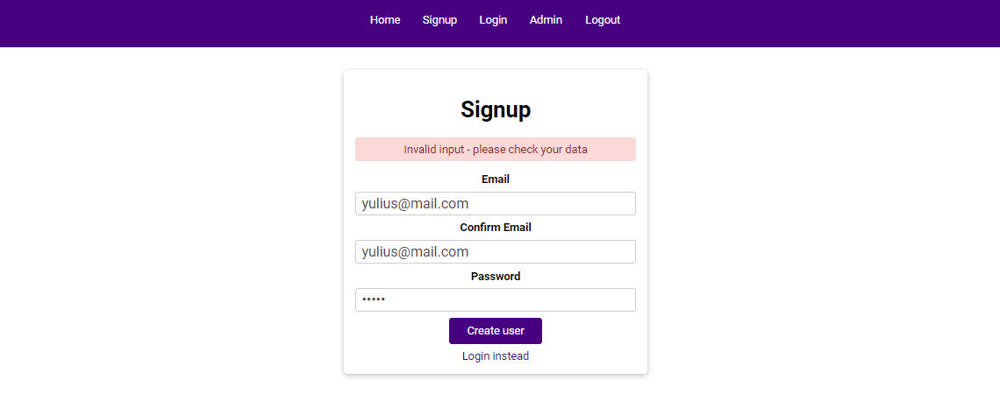

# 100 Days Of Code - 2023 Web Development Bootcamp

## Day 72: Advanced Web Security & Authentication

Welcome to Day 72 of my 100 Days Of Code journey in the "2023 Web Development Bootcamp." Today, we delved into advanced aspects of web security and authentication. Here's a summary of what I explored:

**Day 72 Highlights:**

- **Storing Authentication Data In Sessions**: Explored the secure storage of authentication data in sessions, a critical element in ensuring user security.

- **Using Sessions & Cookies For Controlling Access**: Leveraged sessions and cookies to control access, enhancing the overall security of the web application.

- **Adding The Logout Functionality**: Implemented the logout functionality, an essential feature for enhancing user experience and security.

- **A Closer Look At Cookies**: Examined cookies in-depth, understanding their role and significance in web development beyond authentication.

- **Diving Deeper Into Sessions (Beyond Authentication)**: Went beyond authentication to explore additional functionalities and use cases of sessions.

This day marks a significant milestone in understanding and implementing advanced web security measures. Excited about the enhanced security and user experience! 🚀🔒

Stay tuned for more updates as we continue to explore the vast world of web development technologies! 🌐✨

## Connect With Me

- **Twitter**: [@ylssty17](https://twitter.com/ylssty17)
- **LinkedIn**: [Yulius Setyawan](https://linkedin.com/in/yulius17)

Let's keep learning and coding together! 🌟💻
