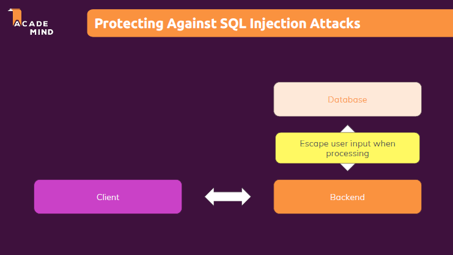
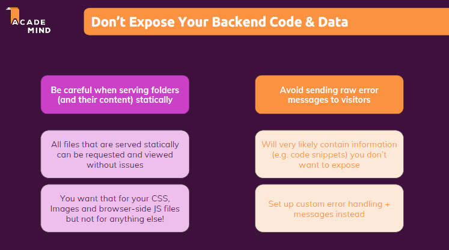

# 100 Days Of Code - 2023 Web Development Bootcamp

## Day 75: Enhancing Blog Authentication & Security

Welcome to Day 75 of my 100 Days Of Code journey in the "2023 Web Development Bootcamp." Today's focus is on enhancing blog authentication and strengthening security measures. Here's a summary of what I explored:

**Day 75 Highlights:**

- **Module Introduction - Blog Authentication:** An overview of the module focusing on reinforcing blog authentication and security.

- **Our Starting Project (Deep Dive):** Delved into our starting project, examining its structure and identifying areas for security improvement.

- **What's Wrong With Our Code?:** Conducted a detailed analysis of our code to identify and rectify potential security loopholes, ensuring a robust and secure authentication system for our blog.

This module marks a crucial step in fortifying our web applications against common security threats. Security is paramount, and I'm excited to continue exploring best practices to create resilient and secure web solutions! 🛡️💻

Stay tuned for more updates as we delve deeper into the realm of web development security! 🌐✨

## Connect With Me

- **Twitter**: [@ylssty17](https://twitter.com/ylssty17)
- **LinkedIn**: [Yulius Setyawan](https://linkedin.com/in/yulius17)

Let's prioritize security and continue learning and coding together! 🌟💻
