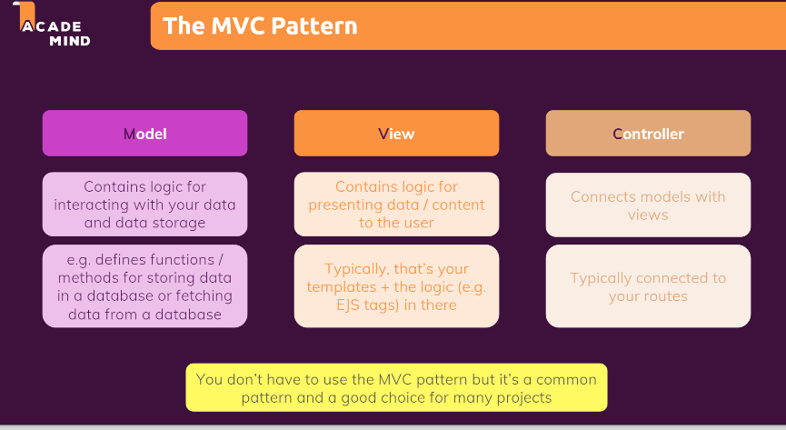
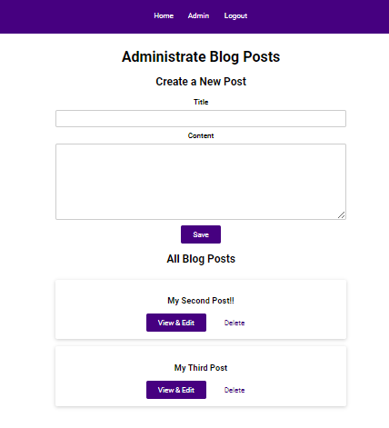

# 100 Days Of Code - 2023 Web Development Bootcamp

## Day 76: Structuring Projects and Embracing the MVC Pattern

Welcome to Day 76 of my 100 Days Of Code journey in the "2023 Web Development Bootcamp." Today's focus revolves around enhancing project structure and diving into the Model-View-Controller (MVC) pattern. Here's a rundown of the key concepts explored:

**Day 76 Highlights:**

- **Route Organization**: Optimized project organization by strategically splitting routes into dedicated files for improved readability and maintainability.

- **Configuration Extraction**: Enhanced flexibility and modularity by extracting configuration settings into a separate file, enabling easy adjustments without code overhauls.

- **Middleware Management**: Streamlined code structure and promoted reusability by extracting custom middleware into standalone files, facilitating their application across various routes.

- **MVC Introduction**: Gained a comprehensive understanding of the MVC pattern, a software design paradigm that separates application logic into distinct components: Models (data), Views (user interface), and Controllers (logic).

- **Model Creation**: Crafted our first model, laying the foundation for data management and interactions within the application.

- **Model Enhancements**: Empowered the model with the ability to update and delete data, ensuring seamless data manipulation and updates.

- **Data Retrieval**: Equipped the model with the capability to retrieve and fetch data efficiently, enabling smooth data retrieval and display within the application.

**Stay tuned for more updates to build well-structured and scalable web applications using the MVC pattern! ️**

## Connect With Me

- **Twitter**: [@ylssty17](https://twitter.com/ylssty17)
- **LinkedIn**: [Yulius Setyawan](https://linkedin.com/in/yulius17)

Let's keep learning and coding together, embracing best practices for a robust and organized development experience! 
